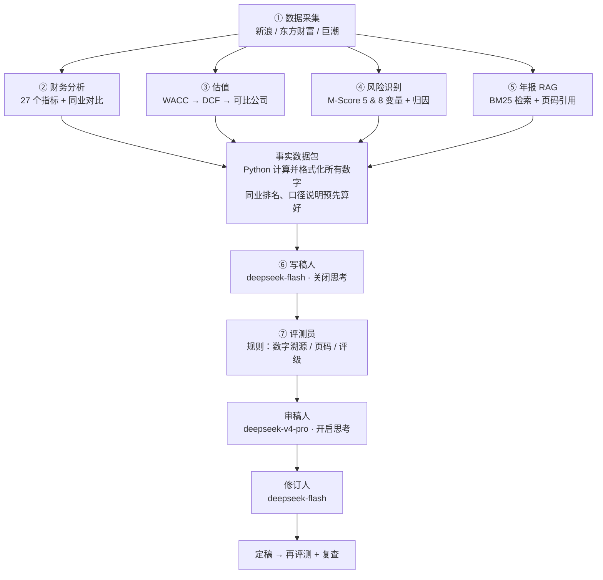

# A-Share Equity Research Agent｜AI 公司深度报告生成器

> 输入一个 A 股代码，自动产出一份**带估值、带年报页码引用、经过审稿 Agent 复核**的公司深度研究报告。
> 7 个可复用 Skill 按顺序编排：数据采集 → 财务分析 → 估值 → 风险识别 → 年报 RAG → 写稿 / 审稿 / 修订 → 自动评测。
>
> An LLM-powered equity research pipeline for China A-shares: Python computes every number, the LLM writes,
> a reasoning model reviews, and rule-based evaluation checks every number and citation.

**案例：云南白药（sz000538）** ｜ 可比公司：片仔癀、同仁堂、白云山、华润三九 ｜ 估值日 2026-10-08

📄 **定稿报告：[reports/sz000538_final.md](reports/sz000538_final.md)**　（迭代过程：[v1](reports/sz000538_draft_v1.md) → [v2](reports/sz000538_draft_v2.md) → [v3](reports/sz000538_draft_v3.md) → final）

---

## 1. 核心结论（案例）

| 项目 | 结果 |
|---|---|
| 评级（规则决定） | **增持**：现价位于合理价值区间底部 2% |
| 合理价值区间 | **50.51 ~ 68.09 元**（DCF，永续增长 2%，WACC 8% ~ 6%） |
| DCF 基准价值 | 68.34 元，较现价 50.89 元 +34.3% |
| WACC | 5.98%（无风险利率 1.69% + 调整 Beta 0.72 × ERP 6%） |
| 可比公司交叉验证 | PE 隐含 67.78 元；PB 48.02 元；EV/EBITDA 48.75 元 |

三个最有价值的发现：

1. **PE 看起来便宜，核心业务并不便宜。** 公司约 280 亿元（占市值 30.8%）是现金、理财和股权投资。PE 17.4x 低于同业中位数 23.2x，但剔除这部分后，核心业务 EV/EBITDA 11.5x 反而高于同业中位数 10.8x。
2. **分歧在折现率，而不在经营判断。** 现价大致对应 WACC 8%、永续增长 2% 的估值；CAPM 在当前低利率环境下给出 6%。模型保留 CAPM 结果，用区间而非单点表达这一分歧。
3. **M-Score 报警是误报，且推理链完整闭环。** 2022 年 Beneish M-Score 报警 → 归因显示 AQI=3.79 贡献 +1.66 → 年报 RAG 找到原因：约 113 亿元战略入股上海医药（2021 年报第 104 页、2022 年报第 203 / 246 页），被模型视为"软资产"。

---

## 2. 架构



每个 Skill 是一个独立文件夹，自带 `SKILL.md`（何时调用、输入、输出、关键设计），由 `run_pipeline.py` 按顺序调度：

| Skill | 作用 | 岗位职责对应 |
|---|---|---|
| [`data_fetch`](skills/data_fetch/SKILL.md) | 报表、折旧摊销、行情、后复权价格、国债收益率 | 数据采集 |
| [`financial_analysis`](skills/financial_analysis/SKILL.md) | 盈利、成长、杜邦、现金流、偿债、营运 | 财务分析 |
| [`valuation`](skills/valuation/SKILL.md) | Beta 回归、WACC、FCFF DCF、敏感性、PE/PB/EV-EBITDA | 估值建模 |
| [`fraud_risk`](skills/fraud_risk/SKILL.md) | 复用项目一并升级为 8 变量 M-Score + 驱动归因 | 财务造假识别 |
| [`annual_report_rag`](skills/annual_report_rag/SKILL.md) | 年报下载、切块、BM25、带页码问答、引用核验 | RAG / 逻辑推理 |
| [`report_writer`](skills/report_writer/SKILL.md) | 写稿、审稿、修订三个 Agent | 报告成文 / 多智能体协同 |
| [`evaluation`](skills/evaluation/SKILL.md) | 规则化自动评测 | AI 自动评测 |

---

## 3. 评测结果

### 3.1 报告迭代（规则评测 + 人工审阅）

| 版本 | 改动 | 数字溯源 | 年报页码引用 | 待年报验证 | 人工审阅发现的问题 |
|---|---|---|---|---|---|
| v1 | 事实数据包 + 规则评级 | 100% | 0 | 5 | 6（含 4 处比较 / 推理错误，如"周转率五家最高"实为第 2） |
| v2 | Python 预先计算同业排名、口径说明、报警驱动 | 99.8%（抓到自行计算的"+4.9 个百分点"） | 0 | 6 | 2（v1 的问题全部修复） |
| v3 | 接入年报 RAG 证据 | 100% | 32（全部有效） | 4 | 3（口径误用、标题偏颇等） |
| **final** | 审稿 + 修订 | **100%（471/471）** | **33（全部有效）** | 4 | — |

### 3.2 审稿 Agent

| | 初稿 v3 | 定稿 final |
|---|---|---|
| 审稿人发现的问题 | 5（中 3 / 低 2） | **1（低）** |
| 修订后评级、区间是否被改动 | — | 否（规则评测通过） |

审稿人与人工审阅对比（v3）：共 7 个问题，**双方只重合 1 个**。审稿人找到 4 个人工漏掉的问题（如"高股权权重压低 WACC"的因果错误、"逐年回落"与 2024 年数据不符）；人工找到 2 个审稿人漏掉的问题（标题"低估值"与正文 EV/EBITDA 结论不一致、可比公司"品牌溢价"理由与低 PE 矛盾）。

### 3.3 年报 RAG

7 个研究问题，**无效引用 0 个**；3 个问题被模型主动标为"证据不足"而非硬答。RAG 数字与 Python 数字可交叉验证：年报销售费用 56.19 亿元 ≈ 13.6% × 营收 411.87 亿元；理财合计 41.7 亿元 ≈ 交易性金融资产 41.92 亿元。

---

## 4. 关键设计决策

| 决策 | 原因 |
|---|---|
| **Python 算数，LLM 写字** | 所有数字提前格式化为字符串放入事实数据包，模型只照抄；评测可逐个溯源 |
| **评级由规则决定** | 现价在合理区间中的位置 → 买入/增持/中性/减持/卖出，不让模型"拍"结论 |
| **把判断前移到 Python** | 排名、口径差异等有确定答案的判断由代码给出，v1 的比较错误在 v2 全部消除 |
| **思考模式按需开关** | 写稿关闭（推理已由 Python 完成；开启时思考耗尽 16k 输出额度导致空报告）；审稿开启（需要真正推理）。关闭后写稿用时 54.6s → 24.3s，输出 15.6k → 6.3k tokens |
| **两种模型分工** | 写稿 / 修订用 flash（快、便宜），审稿用 v4-pro + 思考（强推理） |
| **BM25 而非向量检索** | DeepSeek 官方 API 未提供 embedding；年报术语标准化；jieba 搜索模式解决"上海医药 / 上海医药集团"切词不一致 |
| **避免未来信息** | 估值基准日取估值日已公布的最新资产负债表（按公告日期筛选） |
| **估值假设集中在配置文件** | `config/valuation.toml` 每个假设都有注释说明理由，改假设不改代码 |
| **先探测、再写代码** | 每个外部接口先用探查脚本确认海外可访问性和真实字段 |

---

## 5. 局限性（如实说明）

- **规则评测只能发现"数字错"，发现不了"逻辑错"**：v1 数字溯源率 100%，仍有 4 处推理错误。数值匹配不理解上下文，数据包中碰巧存在相同数值时会漏判。
- **审稿 Agent 召回率有限且有随机性**：未发现标题与正文结论不一致；复查时发现了一个初稿就存在、第一轮漏掉的表述问题。生产环境可考虑多轮或多审稿人投票。
- **估值高度依赖终值**：终值占企业价值约 84%；长期股权投资按账面值加回（上海医药为上市公司，按市值计更准确）。
- **单一案例**：目前只在云南白药上完整验证；可比公司由人工选定。
- **检索质量**：BM25 对"为什么"类问题召回有限（应收账款、销售费用率的完整归因仍标注"待年报验证"）；年报表格的 PDF 文本抽取会丢失结构。
- **数据源**：依赖 AKShare 及新浪、东方财富、巨潮接口，接口变更可能导致数据采集失败。
- 本项目报告由 AI 自动生成，仅用于技术展示，**不构成投资建议**。

---

## 6. 复现

```bash
git clone https://github.com/Junwei-Huangfu/ashare-equity-research-agent.git
cd ashare-equity-research-agent
conda create -n research python=3.12 -y && conda activate research
pip install -r requirements.txt
cp .env.example .env            # 填入你的 DeepSeek API Key（Windows: copy .env.example .env）

python run_pipeline.py --offline    # 无需 API Key，零成本：数据、分析、估值、风险、年报索引
python run_pipeline.py              # 完整流程：年报问答 → 写稿 → 评测 → 审稿 → 修订 → 再评测
python run_pipeline.py --verify     # 额外让审稿人复查定稿
```

更换研究对象：修改 `skills/data_fetch/data_fetch.py` 中的 `COMPANIES`（第一个为目标公司），以及 `config/valuation.toml` 中的假设。

---

## 7. 项目结构

```
├── run_pipeline.py              # 总控：按顺序调度 7 个 Skill
├── config/
│   ├── valuation.toml           # 估值假设（人工判断，带注释）
│   ├── report.toml              # 评级规则、写稿 / 审稿 / 修订模型设置
│   └── rag_questions.toml       # 年报研究问题与检索词
├── skills/
│   ├── data_fetch/              # 每个 Skill：代码 + SKILL.md
│   ├── financial_analysis/
│   ├── valuation/               # wacc.py, dcf.py, comps.py
│   ├── fraud_risk/
│   ├── annual_report_rag/       # fetch_reports.py, index.py, qa.py
│   ├── report_writer/           # writer.py, review.py
│   └── evaluation/
├── data/raw, data/processed     # 原始数据与计算结果（年报 PDF 与检索索引被 git 忽略）
└── reports/                     # 事实数据包、提示词、各版本报告、评测与审稿结果
```

## 8. 与项目一的关系

[ashare-fraud-risk-skill](https://github.com/Junwei-Huangfu/ashare-fraud-risk-skill) 做财务造假识别（康美药业 vs 云南白药）。本项目把它的风险识别模块**原样复用**为 `fraud_risk` Skill，并在补齐折旧数据后升级为 8 变量模型和驱动归因，同时补上估值、RAG、多智能体与更完整的评测。